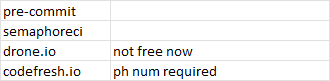

[Java HttpBin Swagger](https://jibijose.github.io/swagger)
==================================
[Java HttpBin Apidocs](https://jibijose.github.io/httpbin/apidocs)
==================================
[Java HttpBin Site](https://jibijose.github.io/httpbin/site)   
==================================   

   

###Github actions   

   
###SonarCloud   

   
   
###Codacy   

   

##Codecov   
   

###Azure Pipeline   

   

###shields.io (#TODO)   

###TODO   

   

.\mvnw nexus-staging:drop
https://dzone.com/articles/deploy-maven-central
https://stackoverflow.com/questions/28846802/how-to-manually-publish-jar-to-maven-central
https://jenkov.com/tutorials/maven/publish-to-central-maven-repository.html
https://central.sonatype.org/publish/publish-maven/#performing-a-release-deployment
https://central.sonatype.org/publish/publish-maven/#releasing-to-central

    
### Requirements

* Java 11+
* Maven 3.0.0 or newer.
* docker optional

### Run locally
./scripts/dockerRun.sh   

### Build locally
./scripts/dockerBuild.sh   

### Cleanup
./scripts/ckeanup.sh  

*************
### TODOs  
upload to maven central  
junit run parallel  
add external curl checkpoints  
https://assertible.com/blog/testing-an-api-using-swagger    
APIS. Cookies, Req/Resp Inspection.  
hold/release endpoints  
ram/cpu/disk speed api
consumer disk speed api.  
Open Api Spec 3.0   
Java api web page   
Date Apis. add delete days/weeks/months/years    
https://github.com/gregswindle/maven-code-quality-pom#437-mvn-pmdcheck   

***************   
#### OpenShift   
https://console-openshift-console.apps.us-east-1.starter.openshift-online.com/console/command-line
oc login --token=TOKEN --server=https://api.us-east-1.starter.openshift-online.com:6443
oc config view

oc get projects
oc project httpbin

oc apply -f openshift.yaml

oc get svc
oc get pods
